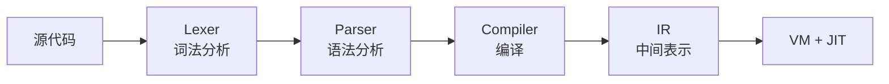

# Aria 语言介绍

## Aria 是什么

Aria 是 JVM 上的轻量嵌入式脚本引擎。
- 自有 KISS 语法（无分号、无 `new`、箭头函数、dot 前缀变量）
- 内置 JavaScript 兼容解析器（ES5.1 大部分 + ES6 class/箭头函数/模板字符串）
- ASM JIT 运行时异步编译
- 适用于：游戏脚本、配置热更新、业务逻辑插件。

技术栈基于 Java 17，使用 ASM 9.6 进行字节码生成（JIT 编译），Gradle 构建，JMH 基准测试。

## 设计理念

KISS — 简单、直接、不过度设计。

- 没有分号，换行即语句结束
- 没有访问修饰符，没有接口，没有抽象类
- 变量声明不需要关键字，通过 dot 前缀自然分发语义
- 函数只有一种形式：`-> {}`

## 核心特点

### dot 前缀变量系统

`var`、`val`、`global`、`server`、`client` 不是关键字，而是普通标识符，通过 `.` 运算符分发到不同的存储层：

```aria
var.x = 10          // 局部可变
val.PI = 3.14       // 局部不可变
global.score = 0    // 全局共享，线程安全
server.config        // 读取触发 listener
client.name = 'A'   // 写入触发 listener
```

### 箭头函数

所有函数使用 `-> {}` 语法定义，参数通过 `args` 访问，函数是一等公民：

```aria
var.add = -> {
    return args[0] + args[1]
}
print(add(3, 4))    // 7
```

### 类系统

单继承，类体内用 `var.xxx` / `val.xxx` 声明字段，`name = -> {}` 定义方法：

```aria
class Animal {
    var.name = 'unknown'
    var.age = 0

    new = -> {
        self.name = args[0]
        self.age = args[1]
    }

    speak = -> {
        return self.name + ' says hello'
    }
}
```

### Java 互操作

通过 `use()` 函数直接访问 JVM 类：

```aria
val.HashMap = use('java.util.HashMap')
val.map = HashMap()
val.System = use('java.lang.System')
System.out.println('hello from aria')
```

### JS 兼容模式

Aria 内置了的 JavaScript 兼容解析器，`.js` 文件自动识别。支持 `var`/`let`/`const`、`function`、箭头函数、`class`/`extends`/`constructor`、`new`、`for-of`、`do-while`、`switch`/`default`、`try`/`catch`/`finally`、`typeof`、`++`/`--`、模板字符串、`?.`、`??` 等 ES6+ 语法。

JS 代码被转换为 Aria AST 后共享同一套 IR/VM/JIT 管线：

```javascript
function greet(name) {
    return `Hello, ${name}!`;
}
console.log(greet('Aria'));  // Hello, Aria!
```

语义映射：`this` → `self`、`null` → `none`、`===` → `==`、`continue` → `next`。详见 [13-javascript-compat](13-javascript-compat.md)。

## 技术架构



- Lexer：将源代码拆分为 Token 流
- Parser：将 Token 流构建为 AST
- Compiler：将 AST 编译为 IR 指令
- VM：解释执行 IR 指令
- JIT：通过 ASM 将热点路径编译为 JVM 字节码

## 快速上手

### Hello World

```aria
print('Hello, Aria!')
```

### 变量

```aria
var.name = 'World'
val.PI = 3.14159
var.msg = "Hello, {name}!"
print(msg)
```

### 函数

```aria
var.greet = -> {
    return 'Hello, ' + args[0] + '!'
}
print(greet('Aria'))    // Hello, Aria!
```

### 类

```aria
class Dog extends Animal {
    var.breed = 'unknown'

    new = -> {
        super(args[0], args[1])
        self.breed = args[2]
    }

    speak = -> {
        return self.name + ' barks!'
    }
}

val.dog = Dog('Rex', 3, 'Labrador')
print(dog.speak())           // Rex barks!
```


## 与其他 JVM 脚本语言的定位对比

JVM 生态中有许多优秀的脚本引擎，各有所长。Groovy 是功能最完整的 JVM 脚本语言，拥有成熟的生态和强大的元编程能力；Nashorn 曾是 JDK 内置的高性能 JS 引擎，其整函数 JIT 编译技术非常出色；Rhino 作为最早的 JVM JS 引擎，至今仍在许多项目中稳定服务。

Aria 并不试图替代它们，而是在"轻量嵌入"这个细分场景下提供另一种选择：

| 特性       | Aria            | Groovy         | Nashorn        | Rhino      |
|----------|-----------------|----------------|----------------|------------|
| 定位       | 轻量嵌入式脚本         | 通用 JVM 语言      | JS 引擎          | JS 引擎      |
| 语法风格     | 自有语法 + JS 兼容双模式 | 类 Java/Ruby 混合 | ECMAScript 5.1 | ECMAScript |
| JS 兼容    | 内置 ES6+ 解析器     | 无              | 原生 JS          | 原生 JS      |
| 变量系统     | dot 前缀（5 种命名空间） | def/var        | var/let/const  | var        |
| 函数语法     | `-> {}` 统一形式    | 闭包 `{ -> }`    | function       | function   |
| 类系统      | 单继承，无修饰符        | 完整 OOP         | 原型链            | 原型链        |
| Java 互操作 | `use()`         | 原生无缝           | `Java.type()`  | `java.xxx` |
| JIT 编译   | ASM 字节码         | Groovy 编译器     | 整函数编译          | 无          |
| 启动开销     | 轻量              | 较重             | 中等             | 较重         |
| 维护状态     | 活跃开发            | 活跃             | JDK 15 后移除     | 社区维护       |

