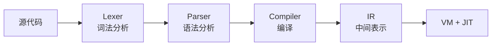

# Aria 语言介绍

## Aria 是什么

Aria 是 JVM 上的轻量嵌入式脚本引擎。
- 自有 KISS 语法（无分号、无 `new`、箭头函数、dot 前缀变量）
- ASM JIT 运行时异步编译
- 适用于：游戏脚本、配置热更新、业务逻辑插件。

技术栈基于 Java 17，使用 ASM 9.6 进行字节码生成（JIT 编译），Gradle 构建，JMH 基准测试。

## 设计理念

KISS — 简单、直接、不过度设计。

- 没有分号，换行即语句结束
- 没有访问修饰符，没有接口，没有抽象类
- 变量声明不需要关键字，通过 dot 前缀自然分发语义
- 函数只有一种形式：`-> {}`

## 核心特点

### dot 前缀变量系统

`var`、`val`、`global`、`server`、`client` 不是关键字，而是普通标识符，通过 `.` 运算符分发到不同的存储层：

```aria
var.x = 10          // 局部可变（跨执行持久）
val.slot            // 宿主注入的只读槽（脚本写入被静默忽略）
global.score = 0    // 全局共享，线程安全
server.config        // 读取触发 listener
client.name = 'A'   // 写入触发 listener
x = 10              // 裸名：当前执行内的临时变量
```

> 裸名与 `var.` / `val.` 是**互相隔离**的命名空间（读写互不回退），
> `val.` 只能由 Java 宿主写入——详见[变量系统](variables)。

### 箭头函数

所有函数使用 `-> {}` 语法定义，参数通过 `args` 访问，函数是一等公民：

```aria
var.add = -> {
    return args[0] + args[1]
}
print(add(3, 4))    // 7.0
```

### 类系统

单继承，类体内用 `var.xxx` / `val.xxx` 声明字段，`name = -> {}` 定义方法：

```aria
class Animal {
    var.name = 'unknown'
    var.age = 0

    new = -> {
        self.name = args[0]
        self.age = args[1]
    }

    speak = -> {
        return self.name + ' says hello'
    }
}
```

### Java 互操作

通过 `use()` 函数直接访问 JVM 类：

```aria
HashMap = use('java.util.HashMap')
m = HashMap()
m.put('key', 'value')

StringBuilder = use('java.lang.StringBuilder')
sb = StringBuilder('hello')
sb.append(' from aria')
print(sb.toString())    // hello from aria
```

## 技术架构


```mermaid
flowchart LR
    A[源代码] --> B[Lexer<br/>词法分析]
    B --> C[Parser<br/>语法分析]
    C --> D[Compiler<br/>编译]
    D --> E[IR<br/>中间表示]
    E --> F[VM + JIT]
```

- Lexer：将源代码拆分为 Token 流
- Parser：将 Token 流构建为 AST
- Compiler：将 AST 编译为 IR 指令
- VM：解释执行 IR 指令
- JIT：通过 ASM 将热点路径编译为 JVM 字节码

## 快速上手

### Hello World

```aria
print('Hello, Aria!')
```

### 变量

```aria
name = 'World'              // 裸名临时变量
var.count = 0               // var：持久存储
msg = "Hello, {name}!"      // 双引号字符串插值（插值读裸名作用域）
print(msg)                  // Hello, World!
```

### 函数

```aria
var.greet = -> {
    return 'Hello, ' + args[0] + '!'
}
print(greet('Aria'))    // Hello, Aria!
```

### 类

```aria
class Animal {
    var.name = 'unknown'
    var.age = 0

    new = -> {
        self.name = args[0]
        self.age = args[1]
    }
}

class Dog extends Animal {
    var.breed = 'unknown'

    new = -> {
        super(args[0], args[1])
        self.breed = args[2]
    }

    speak = -> {
        return self.name + ' barks!'
    }
}

dog = Dog('Rex', 3, 'Labrador')
print(dog.speak())           // Rex barks!
```


