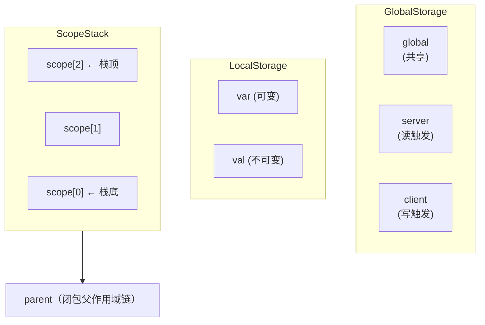

# 变量系统

Aria 的变量系统是语言最核心的设计之一。与传统语言使用关键字（`let`、`const`、`var`）不同，Aria 通过 dot 前缀模式将变量分发到不同的存储层。

## 设计理念

`var`、`val`、`global`、`server`、`client` 不是关键字，而是普通标识符。通过 `.` 运算符访问时，编译器将其分发到对应的存储层。这种设计让变量声明既直观又统一。

5 种命名空间对应 3 层存储：

| 前缀        | 存储层           | 可变性 | 线程安全                 | 特殊行为          |
|-----------|---------------|-----|----------------------|---------------|
| `var.`    | LocalStorage  | 可变  | 否                    | —             |
| `val.`    | LocalStorage  | 不可变 | 否                    | 赋值后不可修改       |
| `global.` | GlobalStorage | 可变  | 是（ConcurrentHashMap） | 跨上下文共享        |
| `server.` | GlobalStorage | 可变  | 是                    | 读取触发 listener |
| `client.` | GlobalStorage | 可变  | 是                    | 写入触发 listener |

---

## var.xxx — 局部可变变量

存储在 `LocalStorage` 的 `varVariables`（ConcurrentHashMap）中。可以重复赋值。

```aria
var.x = 10
var.x = 20           // 可重新赋值
print(x)             // 20
```

声明后可以通过裸标识符直接访问：

```aria
var.name = 'Alice'
print(name)          // 裸标识符访问
name = 'Bob'         // 裸标识符赋值（写入 ScopeStack）
```

---

## val.xxx — 局部不可变变量

存储在 `LocalStorage` 的 `valVariables` 中，使用 `ValueReference`（区别于 var 的 `VariableReference`）。赋值后不可修改。

```aria
val.PI = 3.14159
val.MAX = 100

// PI = 0            // 错误：val 不可变
```

适合用于常量和不应被修改的值：

```aria
val.config = {'debug': false, 'version': '1.0'}
```

### Java 端覆写 val

虽然脚本端无法修改 val 变量，但 Java 宿主端可以通过 `forceSetLocalValue` 强制覆写：

```java
Context ctx = Aria.createContext();
// 脚本中声明 val
Aria.compile("test", ctx, "val.PI = 3.14", Aria.Mode.ARIA).execute();

// Java 端强制修改
ctx.forceSetLocalValue(VariableKey.of("PI"), new NumberValue(3.14159265));

// 脚本中读到新值
Aria.compile("test", ctx, "return val.PI", Aria.Mode.ARIA).execute();
// → 3.14159265
```

这个设计保证了 Java 宿主端对上下文的完全控制权。常量折叠和 JIT 不依赖 val 的不可变假设，所以覆写是安全的。

---

## global.xxx — 全局变量

存储在 `GlobalStorage` 的 `globalVariables`（ConcurrentHashMap）中。所有 Context 共享同一个 GlobalStorage 实例，因此 global 变量跨上下文可见，天然线程安全。

```aria
global.score = 0
global.score += 10
print(global.score)  // 10
```

典型用途：跨脚本共享状态、全局计数器、配置项。

---

## server.xxx — 服务端变量

存储在 `GlobalStorage` 的 `serverVariables` 中，使用 `ServerReference`。读取时触发 `ServerVariableListener`，允许宿主程序在脚本读取变量时动态提供值。

```aria
var.data = server.config     // 读取触发 listener
var.hp = server.playerHP     // 宿主程序可在此时计算并返回值
```

适用场景：脚本需要从宿主程序获取实时数据（如游戏状态、配置信息）。

---

## client.xxx — 客户端变量

存储在 `GlobalStorage` 的 `clientVariables` 中，使用 `ClientReference`。写入时触发 `ClientVariableListener`，允许宿主程序响应脚本的状态变更。

```aria
client.name = 'Player1'      // 写入触发 listener
client.status = 'ready'      // 宿主程序收到通知
```

适用场景：脚本向宿主程序推送状态变更（如 UI 更新、事件通知）。

---

## 裸标识符查找规则

不带前缀的标识符（裸标识符）通过 `ScopeStack` 查找。ScopeStack 是一个数组实现的块级作用域栈，查找时从栈顶向下遍历：

```aria
var.x = 10
print(x)             // 裸标识符，通过 ScopeStack 查找
```

查找流程（`ScopeStack.get(key)`）：

1. 从当前层（栈顶）向下逐层查找
2. 如果本栈未找到，沿 `parent` 链查找（闭包变量捕获）
3. 如果仍未找到，在当前层自动创建一个新的 `VariableReference`（初始值为 `none`）

```aria
var.x = 10
if (true) {
    // 进入新的 scope 层
    print(x)         // 向下查找，找到外层的 x
    var.y = 20
}
// y 在 scope pop 后不再可见
```

---

## ~= 初始化运算符

`~=` 是 Aria 特有的初始化运算符。语义：如果变量已存在则获取当前值，不存在则初始化为右侧的值。

```aria
var.count ~= 0       // 首次执行：声明并赋值 0
var.count ~= 0       // 再次执行：变量已存在，不覆盖，获取已有值
count += 1
print(count)         // 1
```

典型用途：在可能被多次执行的代码块中安全地初始化变量，避免重复赋值覆盖已有状态。

```aria
// 循环或回调中安全初始化
var.total ~= 0
total += newValue
```

---

## self 和 args 特殊标识符

### self

当前对象引用，在类方法中使用。Context 内部维护一个 `self` 字段，创建函数调用上下文时通过 `createCallContext(self, args)` 注入。

```aria
class Player {
    var.name = 'unknown'
    var.hp = 100

    new = -> {
        self.name = args[0]
        self.hp = args[1]
    }

    info = -> {
        return self.name + ' HP: ' + self.hp
    }
}

val.p = Player('Alice', 80)
print(p.info())      // Alice HP: 80
```

### args

函数参数列表。Context 内部维护一个 `IValue<?>[]` 数组，通过索引访问各参数：

```aria
var.add = -> {
    return args[0] + args[1]
}
print(add(3, 4))     // 7

var.sum = -> {
    var.total = 0
    for (i in Range(0, args.length)) {
        total += args[i]
    }
    return total
}
```

`self` 默认为 `NoneValue.NONE`，`args` 默认为空数组。

---

## 作用域规则

Aria 的作用域由 3 层存储 + ScopeStack 共同构成：

### 存储层级



### 闭包捕获

函数调用时通过 `createCallContext` 创建新上下文，共享 `GlobalStorage` 和 `LocalStorage`，但创建独立的 `ScopeStack`。父作用域的变量通过快照（`snapshot()`）注入新栈底层，实现闭包变量捕获（共享引用，非复制值）。

```aria
var.x = 10
var.fn = -> {
    return x + 1     // 捕获外层的 x
}
print(fn())          // 11
x = 20
print(fn())          // 21（共享引用，值已更新）
```

### 异步上下文

`async {}` 块通过 `createAsyncContext()` 创建新上下文，共享 `GlobalStorage` 和 `LocalStorage`，但使用独立的 `ScopeStack`，避免并发修改作用域栈。
