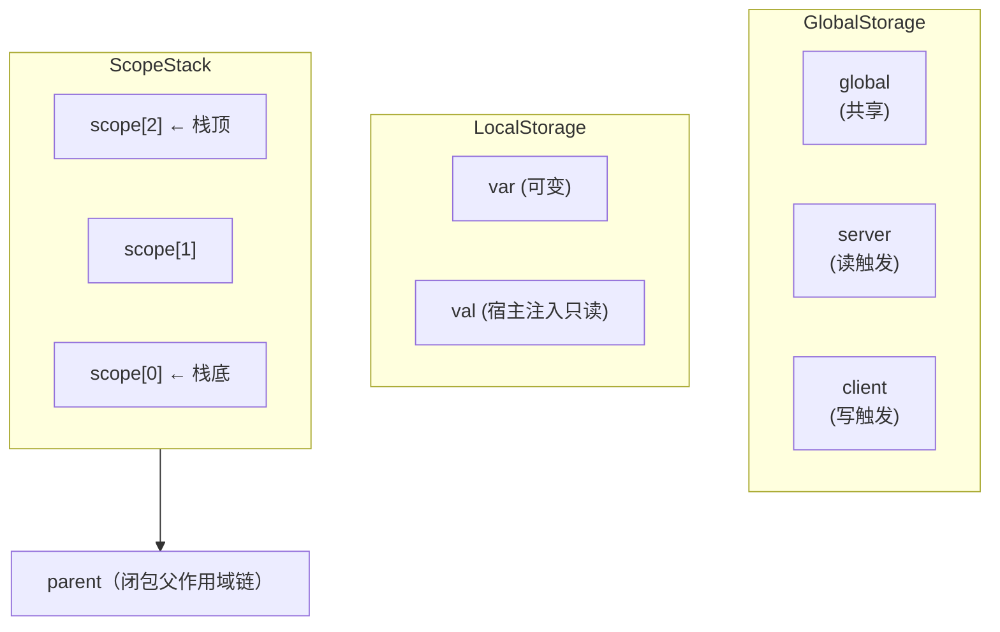

# 变量系统

Aria 的变量系统是语言最核心的设计之一。与传统语言使用关键字（`let`、`const`、`var`）不同，Aria 通过 dot 前缀模式将变量分发到不同的存储层。

## 设计理念

`var`、`val`、`global`、`server`、`client` 不是关键字，而是普通标识符。通过 `.` 运算符访问时，编译器将其分发到对应的存储层。这种设计让变量声明既直观又统一。

5 种命名空间对应 3 层存储：

| 前缀        | 存储层           | 脚本可写          | 线程安全                 | 特殊行为          |
|-----------|---------------|---------------|----------------------|---------------|
| `var.`    | LocalStorage  | 可写            | 否                    | —             |
| `val.`    | LocalStorage  | **不可写（静默忽略）** | 否                    | 仅宿主可注入（只读槽）   |
| `global.` | GlobalStorage | 可写            | 是（ConcurrentHashMap） | 跨上下文共享        |
| `server.` | GlobalStorage | 可写            | 是                    | 读取触发 listener |
| `client.` | GlobalStorage | 可写            | 是                    | 写入触发 listener |

> **命名空间完全隔离**：裸标识符（无前缀）、`var.`、`val.` 是三个互不相通的命名空间，
> 读写**互不回退**——`var.x = 10` 之后读裸名 `x` 得到的是 `none`（另一个变量），反之亦然。

---

## var.xxx — 局部可变变量

存储在 `LocalStorage` 的 `varVariables`（ConcurrentHashMap）中。可以重复赋值。

```aria
var.x = 10
var.x = 20           // 可重新赋值
print(var.x)         // 20.0
```

注意 `var.name` 与裸标识符 `name` 是**两个不同的变量**（命名空间隔离，读写互不回退）：

```aria
var.name = 'Alice'
print(name)          // ''（裸名 name 未定义 → none，不回退读 var.name）
name = 'Bob'         // 写入的是裸名（ScopeStack），var.name 仍是 'Alice'
print(var.name)      // Alice
```

例外：**函数调用位置**的裸名会回退到 `var` 存储查找——`var.f = -> {...}` 之后
可以直接写 `f()` 调用（详见[函数](functions)）。

---

## val.xxx — 宿主注入的只读槽

存储在 `LocalStorage` 的 `valVariables` 中，使用 `ValueReference`（区别于 var 的 `VariableReference`）。

**脚本对 `val.` 的任何写入都会被静默忽略（no-op）**——`val` 不是"脚本内常量"，
而是宿主（Java 端）通过 `forceSetValue` 注入、脚本只读的变量槽：

```aria
val.PI = 3.14159     // 静默忽略，什么都不会发生（不报错）
print(val.PI)        // ''（宿主未注入时读到 none）
```

脚本中需要临时变量或常量时，请使用裸名（当前执行内有效）或 `var.`（持久存储）：

```aria
PI = 3.14159         // 裸名：本次执行内可用
var.MAX = 100        // var：跨执行持久
```

### Java 端注入 val

只有 Java 宿主端可以写入 val 变量（`forceSetLocalValue` / 引用上的 `forceSetValue`），
这保证了宿主注入的值（如控件句柄、环境常量）不会被脚本污染：

```java
Context ctx = Aria.createContext();

// Java 端注入
ctx.forceSetLocalValue(VariableKey.of("PI"), new NumberValue(3.14159265));

// 脚本中读取
Aria.compile("test", ctx, "return val.PI").execute();
// → 3.14159265

// 脚本中写 val.PI 是 no-op，注入值保持不变
Aria.compile("test", ctx, "val.PI = 0\nreturn val.PI").execute();
// → 仍是 3.14159265
```

> 注意：引用上的普通 `setValue` 对 val 同样是 no-op（与脚本写入同一语义），
> 宿主注入**必须**使用 `forceSetValue` / `forceSetLocalValue`。

例外：**类体内的 `val.x = ...` 是字段声明**，与 `var.x` 等价（见[类与继承](classes)）；
**模块顶层的 `export val.x = ...`** 也正常导出（见[模块系统](modules)）。

---

## global.xxx — 全局变量

存储在 `GlobalStorage` 的 `globalVariables`（ConcurrentHashMap）中。所有 Context 共享同一个 GlobalStorage 实例，因此 global 变量跨上下文可见，天然线程安全。

```aria
global.score = 0
global.score += 10
print(global.score)  // 10.0
```

典型用途：跨脚本共享状态、全局计数器、配置项。

---

## server.xxx — 服务端变量

存储在 `GlobalStorage` 的 `serverVariables` 中，使用 `ServerReference`。读取时触发 `ServerVariableListener`，允许宿主程序在脚本读取变量时动态提供值。

```aria
var.data = server.config     // 读取触发 listener
var.hp = server.playerHP     // 宿主程序可在此时计算并返回值
```

适用场景：脚本需要从宿主程序获取实时数据（如游戏状态、配置信息）。

---

## client.xxx — 客户端变量

存储在 `GlobalStorage` 的 `clientVariables` 中，使用 `ClientReference`。写入时触发 `ClientVariableListener`，允许宿主程序响应脚本的状态变更。

```aria
client.name = 'Player1'      // 写入触发 listener
client.status = 'ready'      // 宿主程序收到通知
```

适用场景：脚本向宿主程序推送状态变更（如 UI 更新、事件通知）。

---

## 裸标识符查找规则

不带前缀的标识符（裸标识符）通过 `ScopeStack` 查找。ScopeStack 是一个数组实现的块级作用域栈，查找时从栈顶向下遍历：

```aria
x = 10
print(x)             // 裸标识符，通过 ScopeStack 查找 → 10.0
```

查找流程（`ScopeStack.get(key)`）：

1. 从当前层（栈顶）向下逐层查找
2. 如果本栈未找到，沿 `parent` 链查找
3. 如果仍未找到，在当前层自动创建一个新的引用（初始值为 `none`）

裸标识符**不会**回退到 `var` / `val` 存储（也不会反向回退）；
读取未定义的裸名得到 `none`，不报错。

```aria
x = 10
if (true) {
    // 进入新的 scope 层
    print(x)         // 向下查找，找到外层的 x
    y = 20
}
// y 在 scope pop 后不再可见（此处读 y 得 none）
```

---

## ~= 初始化运算符

`~=` 是 Aria 特有的初始化运算符。语义：如果变量已存在则获取当前值，不存在则初始化为右侧的值。

```aria
var.count ~= 0       // 首次执行：声明并赋值 0
var.count ~= 0       // 再次执行：变量已存在，不覆盖，获取已有值
var.count += 1
print(var.count)     // 1.0
```

典型用途：在可能被多次执行的代码块中安全地初始化变量，避免重复赋值覆盖已有状态。

```aria
// 跨执行安全初始化（注意保持 var. 前缀，裸名与 var 不相通）
var.total ~= 0
var.total += newValue
```

---

## self 和 args 特殊标识符

### self

当前对象引用，在类方法中使用。Context 内部维护一个 `self` 字段，创建函数调用上下文时通过 `createCallContext(self, args)` 注入。

```aria
class Player {
    var.name = 'unknown'
    var.hp = 100

    new = -> {
        self.name = args[0]
        self.hp = args[1]
    }

    info = -> {
        return self.name + ' HP: ' + self.hp
    }
}

p = Player('Alice', 80)
print(p.info())      // Alice HP: 80.0
```

### args

函数参数列表。Context 内部维护一个 `IValue<?>[]` 数组，通过索引访问各参数：

```aria
var.add = -> {
    return args[0] + args[1]
}
print(add(3, 4))     // 7.0

var.sum = -> {
    total = 0                              // 函数体内的裸名临时变量
    for (i = 0; i < args.length; i++) {
        total += args[i]
    }
    return total
}
print(sum(1, 2, 3))  // 6.0
```

越界读取 `args[i]` 返回 `none`（不抛异常）。

`self` 默认为 `NoneValue.NONE`，`args` 默认为空数组。

---

## 作用域规则

Aria 的作用域由 3 层存储 + ScopeStack 共同构成：

### 存储层级


```mermaid
flowchart TD
    subgraph GlobalStorage
        G["global<br/>(共享)"]
        S["server<br/>(读触发)"]
        C["client<br/>(写触发)"]
    end
    subgraph LocalStorage
        V["var (可变)"]
        VL["val (宿主注入只读)"]
    end
    subgraph ScopeStack
        S2["scope[2] ← 栈顶"]
        S1["scope[1]"]
        S0["scope[0] ← 栈底"]
    end
    ScopeStack --> P["parent（闭包父作用域链）"]
```

### 函数体作用域隔离

函数（`-> {}`）调用时创建**全新的 `ScopeStack`**，与定义处的裸名临时变量**完全隔离**——
体内读外层裸名得 `none`，体内写裸名也不影响外层。函数体与外层共享的只有
`var` / `val`（`LocalStorage`）、`global` / `server` / `client`（`GlobalStorage`）与 `self` / `args`。
跨函数共享的状态请使用 `var.` 存储。

```aria
var.x = 10
var.fn = -> {
    return var.x + 1   // 经 var 存储共享 ✓
}
print(fn())            // 11.0

y = 10
var.g = -> {
    return y + 1       // 体内 y 不可见 → none + 1
}
print(g())             // 1.0（隔离：外层裸名 y 读不到）
```

### 异步（async / await）

`async { ... }` 是一个**表达式**，把块体提交到线程池**并发执行**，立即返回一个 **Promise**；`await` 阻塞当前线程取回结果。

```aria
var.x = 10
var.p = async {
    return var.x + 1 // 经 var 存储共享；在 worker 线程执行（裸名与外层隔离）
}
var.r = await var.p  // 阻塞直到完成 → 11.0
```

实现保证：

- **真并发**：块体在 `ThreadPoolManager` 的 worker 线程执行，主线程不阻塞（直到 `await`）；块体**只执行一次**。
- **作用域隔离**：块体用全新 `ScopeStack`——外层裸名不可见；共享的是 `GlobalStorage` / `var` 存储与 `self` / `args`。
- **沙箱传播**：当前沙箱配置随任务传播到 worker 线程——受限沙箱下 async 块体同样受命名空间/资源限制约束。
- **异常**：块体抛出的异常会让 Promise 进入 rejected，`await` 时抛出。

> 并发注意：async 块体与主线程**共享 `var` / `global` 存储**。推荐块体「只读外层 + 计算 + 返回」；多个线程并发修改同一变量与普通多线程一样需自行同步。
